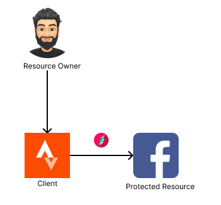

## OAuth Definition

Definition of OAuth from RFC 6749 <https://tools.ietf.org/html/rfc6749>

"The OAuth 2.0 authorization framework enables a third-party application to obtain limited access to an HTTP service, either on behalf of a resource owner by orchestrating an approval interaction between the resource owner and the HTTP service, or by allowing the third-party application to obtain access on its own behalf."

## OAuth components

- Resource owner: An actual person that has access to an API. This person is comfortable and able able to delegate access to that API. This person also has access to a web browser.
- Protected resource: The component that the resource owner has access to. This is normally an API.
- Client: The piece of software that access the protected resource on behalf of the resource owner.

Let's say you are tracking your fitness activities through a sport activity tracking mobile application called Strava. You would like Strava to make a post on your behalf to your own Facebook account every time you finish a workout session.

Let's map out the OAuth components in this example:

- You are the OAuth `resource owner` since you are the owner of your Facebook account.
- Your Facebook account is the OAuth `protected resource`.
- Strava is the OAuth `client` that is trying to get access to Strava on the your (resource owner) behalf.

The end goal is for Strava to be given access to your Facebook account in order to make posts. In other words, you as the user need to delegate authorization to the client (strava), so the client can access the protected resource (Facebook).


## Potential Solutions for Client Authorization

Let's think of the most basic authorization setup in order for Strava to connect to your Facebook account. Strava asks you for the username and password of your Facebook account and connects on your behalf.


Although, there are many problems with this approach, the goal is achieved! Strava can now make posts on your behalf to your Facebook account! There are definitely areas of improvement in this setup. Let's look at the current challenges we face with this setup:

- Strava has total control of your Facebook account and can do any action.
- Facebook has no way of differentiating between you and Strava since Strava is using the same username and password that you are using to login.
- Strava has stored your username and password on it's database for use in the future. So it does not have to notify you every time it will post on Facebook.

Yikes! By solving the connection problem, we seem to have made quite a mess!

What if Strava could create a partnership with Facebook and get access to _all_ Facebook accounts by using a very secret password that is given by Facebook. This secret password would only allow Strava to make posts for users and nothing else. For example, Strava will not be able to send a Facebook friend a direct message on behalf of any user. Strava will _only_ be allowed to publish Facebook posts on behalf of any user.



As in the previous solution, the end goal is reached. Strava is now connected to Facebook and can public posts on your behalf. The benefit of this solution is that Strava will not have a need to ask for your password, or act on your behalf. Strava would just need to know your username and use it's all powerful, secret password given by Facebook to make a post on your behalf. Just like it can do for any other user. Although this approach solves some of the problems mentioned in the previous solution, there are still some glaring flaws:

- If Strava gets hacked, then Facebook would be compromised since the hackers are now in control of the very powerful password that can make posts on behalf of any user.
- It's highly unlikely that Facebook would ever give any app this kind of powerful permission.
- You, as a user do not have much control in this situation. For example, you can't revoke Strava's access to your Facebook account. Strava can freely make posts on your behalf whenever it wants.

Let's take this solution a little further!

What if _you_ could provide a Facebook password (other than your own) to Strava that will allow Strava to _only_ post on your behalf and nothing else. For example _Strava_ will not be able to view your friends list because it only has just enough access to post on your behalf. Let's name this password that you will provide a `token`.


This is looking much better than the very first solution of Strava replaying the user credentials to Facebook. Strava now only has access to posting on your behalf. You can revoke access to Strava at any time by changing the password that you provided Strava. Also, Strava does not have universal access to make posts for any user anymore. Although this is a good solution, it is still not optimal. Let's discuss the challenges we face with this setup:

- What if you as a user have several fitness app that track your health and post for you on your Facebook account. You would have to manage several passwords (tokens) for each fitness app. You could provide the same token for each fitness app but that would lead to a security risk. Meaning, if one fitness app token is compromised, all other fitness apps would be at risk.
- There is no way for you to revoke access to Strava other than changing your password. So there is no correlation between the Strava (client) and the token.

We can still do better than this!

What if we were able to have this token issued separately for each client and user combination to be used at a protected resource? What if there was a network protocol that allowed for the generation and secure distribution of these credentials? Now we are getting somewhere!

## Delegating Access

The network protocol in question is called OAuth!
Once again, the end goal is for the you to _delegate_ your authority of your Facebook account to Strava, so it can publish posts on your behalf. OAuth introduces another component into the solution called the _Authorization Server_.


The Authorization Server establishes trust between itself and the protected resource (your Facebook account). The green line is the goal! To establish a connection between Strava and your Facebook account. In other words, the goal is to establish a connection between the client and the protected resource by delegating the user's access to the client.

For you to delegate your authorization of you Facebook to Strava, you will first login to Strava on you Strava account. You will then be sent to the authorization server. Once you are authenticated on the authorization server, you will be given a choice if you would like to delegate you authorization to Strava on the authorization server. The authorization server will tell you exactly what Strava will be able to do on your Facebook account. If you agree, the authorization server will send a special token to Strava called an _OAuth authorization token_ which will allow Strava to connect to your Facebook account and publish posts! You have successfully delegated your authorization of your Facebook to Strava,

Phew! That was a lot. This OAuth solution might be difficult to understand by simply reading through the previous paragraph, so let's see it in action through an animated diagram!

```
create an animated diagram of the OAuth flow mentioned above.
```


That is the entire OAuth flow at a very high level! If you reached this point and understood the concepts then that means you understand what OAuth is! Well done! :rocket:

In the next blog posts, we will dive deep into each OAuth component and discuss their inner workings.
