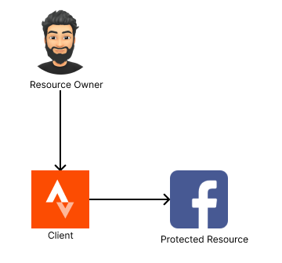
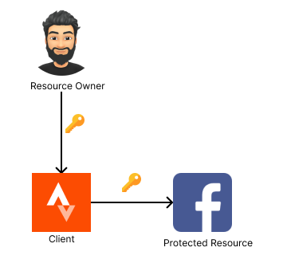
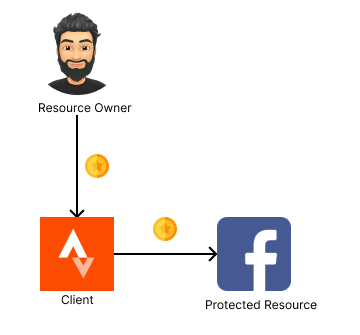

## OAuth 2.0 Definition

Here is the official definition of of OAuth 2.0 according to
[RFC 6749](https://tools.ietf.org/html/rfc6749):

"The OAuth 2.0 authorization framework enables a third-party application to
obtain limited access to an HTTP service, either on behalf of a resource
owner by orchestrating an approval interaction between the resource owner
and the HTTP service, or by allowing the third-party application to obtain
access on its own behalf."

<!-- markdownlint-disable -->
<!-- prettier-ignore-start -->
:::sweatingDuck
That is quite a confusing definition!
:::

:::me
Don't worry! After reading through this article, try to read this
definition again. I promise you it will make sense.
:::

:::joyfulDuck
Okay, let's go!
:::
<!-- markdownlint-restore -->
<!-- prettier-ignore-end -->

One of the main use cases of OAuth 2.0 is to give third party applications
limited access to the private resources that you own. We will see how that
is exactly done throughout this article. Let's discuss an example where
OAuth can be used.

Let's say you are tracking your fitness activities through a sport activity
tracking mobile application called
[Strava](https://apps.apple.com/us/app/strava-run-bike-walk/id426826309).
You would like Strava to automatically make a post on your behalf to your
Facebook account so your friends can see your sports activity.

Throughout this article, we’ll explore several methods for connecting
Strava to your Facebook account. We’ll begin with the simplest connection
options and progress toward implementing a complete OAuth flow:

<iframe
  src="https://player.mux.com/VeohLY4KkMoOgaV4hBRgKRQ022202io2XAYscSVO02u01bk?metadata-video-title=Authorization+grant+type+flow&video-title=Authorization+grant+type+flow"
  style="width: 100%; border: none; aspect-ratio: 1/1;"
  allow="accelerometer; gyroscope; autoplay; encrypted-media; picture-in-picture;"
  allowfullscreen
></iframe>

<!-- markdownlint-disable -->
<!-- prettier-ignore-start -->
:::me
Don't worry if the above animation looks confusing. We're going to start
off very simple. You will eventually undersatnd this flow when you get to
the end of this article. I believe in you!
:::
<!-- markdownlint-restore -->
<!-- prettier-ignore-end -->

First of all, let's discuss the various components that we will see when
learning OAuth 2.0.

## OAuth 2.0 components

- **Resource Owner**: This is the person who controls access to an API and
  can grant limited permission to another application. In other words, they
  decide to share access to certain parts of their API with another app.
  The resource owner also uses a web browser to approve this access. In our
  example, the resource owner is you 🫵! You own the Facebook account (the
  API) that Strava wants limited access to, so it can post on your behalf.
- **Protected Resource**: The component that the resource owner (you) has
  access to. This is normally an API. In our example, the Protected
  Resource will be your Facebook account.
- **Client**: The piece of software that access the protected resource
  (your Facebook account) on behalf of the resource owner (you). In our
  example the Client is the Strava.

Let's map out the OAuth components once again according to our example:

- You are the OAuth `Resource Owner` since you are the owner of your
  Facebook account.
- Your Facebook account is the OAuth `Protected Resource`.
- Strava is the OAuth `Client` that is trying to get access to Facebook on
  your behalf to make a Facebook post of what exercise you did so your
  friends can see that you're not lazy!

The end goal is for Strava to be given access to your Facebook account in
order to make posts. In other words, you as the user need to delegate
authorization to the Client (Strava), so the Client can access the
Protected Resource (your Facebook account).



<!-- markdownlint-disable -->
<!-- prettier-ignore-start -->
:::joyfulDuck
I see how the Resource Owner, Client, and Protected Resource relate to our Strava example now!
:::

:::magnifyingglassme
Let's see how we can authorize Strava to make a Facebook post on your
behalf.
:::
<!-- markdownlint-restore -->
<!-- prettier-ignore-end -->

## Client Authorization

Let's think of the most basic authorization setup in order for Strava to
connect to your Facebook account. Strava asks you for the username and
password of your Facebook account and connects on your behalf.



Although, there are many problems with this approach, the goal is achieved!
Strava can now make posts on your behalf to your Facebook account! There
are definitely areas of improvement in this setup. Let's look at the
current challenges we face with this setup:

- Strava has total control of your Facebook account and can do any action.
- Facebook has no way of differentiating between you and Strava since
  Strava is using the same username and password that you are using to
  login.
- Strava has stored your username and password on its database for use in
  the future. So it does not have to notify you every time it will post on
  Facebook.

Yikes! By solving the connection problem, we seem to have made quite a
mess! We can do better!

Here is another solution: what if Strava could create a partnership with
Facebook and get access to _all_ Facebook accounts by using a very secret
password that is given by Facebook. This secret password would only allow
Strava to make posts for users and nothing else. For example, Strava will
not be able to send a Facebook friend a direct message on behalf of any
user. Strava will _only_ be allowed to publish Facebook posts on behalf of
any user.


As in the previous solution, the end goal is reached. Strava is now
connected to Facebook and can public posts on your behalf. The benefit of
this solution is that Strava will not have a need to ask for your password,
or act on your behalf. Strava would just need to know your username and use
it's all powerful, secret password given by Facebook to make a post on your
behalf. Just like it can do for any other user. Although this approach
solves some of the problems mentioned in the previous solution, there are
still some glaring flaws:

- If Strava gets hacked, then Facebook would be compromised since the
  hackers are now in control of the very powerful password that can make
  posts on behalf of any user.
- It's highly unlikely that Facebook would ever give any app this kind of
  powerful permission.
- You, as a user do not have much control in this situation. For example,
  you can't revoke Strava's access to your Facebook account. Strava can
  freely make posts on your behalf whenever it wants.

Let's take this solution a little further!

What if _you_ could provide a Facebook password (other than your own) to
Strava that will allow Strava to _only_ post on your behalf and nothing
else. For example, _Strava_ will not be able to view your friends list
because it only has just enough access to post on your behalf. Let's name
this password that you will provide a `token`.



This is looking much better than the very first solution of Strava
replaying the user credentials to Facebook. Strava now only has access to
posting on your behalf. You can revoke access to Strava at any time by
changing the password that you provided Strava. Also, Strava does not have
universal access to make posts for any user anymore. Although this is a
good solution, it is still not optimal. Let's discuss the challenges we
face with this setup:

- What if you as a user have several fitness app that track your health and
  post for you on your Facebook account. You would have to manage several
  passwords (tokens) for each fitness app. You could provide the same token
  for each fitness app but that would lead to a security risk. Meaning, if
  one fitness app token is compromised, all other fitness apps would be at
  risk.
- There is no way for you to revoke access to Strava other than changing
  your password. So there is no correlation between the Strava (client) and
  the token.

We can still do better than this!

What if we were able to have this token issued separately for each client
and user combination to be used at a protected resource? What if there was
a network protocol that allowed for the generation and secure distribution
of these credentials? Now we are getting somewhere!

## Delegating Access

The network protocol in question is called OAuth! Once again, the end goal
is for the you to _delegate_ your authority of your Facebook account to
Strava, so it can publish posts on your behalf. OAuth introduces another
component into the solution called the _Authorization Server_.


The Authorization Server establishes trust between itself and the protected
resource (your Facebook account). The green line is the goal! To establish
a connection between Strava and your Facebook account. In other words, the
goal is to establish a connection between the client and the protected
resource by delegating the user's access to the client.

For you (the OAuth user) to delegate the authorization of your Facebook
account to Strava, the following steps will occur:

1. You access Strava (the OAuth client).
2. Strava redirects you to the Authorization Server.
3. You authenticate yourself to the Authorization Server.
4. You will be given a choice if you would like to delegate your
   authorization to Strava. The Authorization Server will tell you exactly
   what Strava will be able to do on your Facebook account. You consent to
   delegate authorization of your Facebook account to Strava.
5. Then the authorization server will send a special token to Strava called
   an _OAuth Access Token_ which will allow Strava to connect to your
   Facebook account and publish posts!
6. You have successfully delegated your authorization of your Facebook
   account. Strava is now able to make a Facebook post on your behalf.

<!-- markdownlint-disable -->
<!-- prettier-ignore-start -->
:::me
Phew! That was a lot. The OAuth flow might be difficult to understand
by simply reading through the previous steps. To make things easier, let's
see the OAuth flow in action through an animated diagram!
:::
<!-- markdownlint-restore -->
<!-- prettier-ignore-end -->

<iframe
  src="https://player.mux.com/FDBQwXfFFpyhSJzqsv2PqEladt8Cww4fxsew7OOsvpA?metadata-video-title=Implicit+flow&video-title=Implicit+flow"
  style="width: 100%; border: none; aspect-ratio: 1/1;"
  allow="accelerometer; gyroscope; autoplay; encrypted-media; picture-in-picture;"
  allowfullscreen
></iframe>


## Enhancing Security

There is a security risk with the flow mentioned above. The entire
authorization flow is happening on the
[front channel](https://beingcraftsman.com/2023/12/02/simple-guide-to-front-channel-and-back-channel-requests/),
from the browser, which can be listened to by an attacker. In that case, an
attacker can intercept the flow and grab the OAuth Authorization Token for
malicious activities.

To guard the authorization flow from attackers, OAuth has introduced
another token called the `OAuth authorization code`. This will be passed
totally through the back channel which is highly secure. If an attacker was
intercepting the user's browser, the attacker would only be able to access
the front channel requests, not back channel, so the attacker would not get
access to the authorization code.

Similar to the authorization code, the authorization token is also
communicated through the back channel. This means that both the
authorization code and the authorization token are treated as secret data
that should not be shared.

So how does the authorization code get used in the above mentioned flow?

The authorization code is sent to the client from the authorization server,
after the user approves the client. As mentioned, this Authorization Code
is sent on the back channel. Also, the user gets redirected back to the
client from the authorization server on the front channel.

Once the client has the Authorization Code, the next step for the client is
to request and Authorization Token from the Authorization Server. Once the
client has the Authorization Token, the client can freely make Facebook
posts for the specified user.

<!-- <video src="https://github.com/user-attachments/assets/052946d3-669d-4fdc-90c3-6857f50f759f" controls autoplay loop muted></video> -->
<iframe
  src="https://player.mux.com/VeohLY4KkMoOgaV4hBRgKRQ022202io2XAYscSVO02u01bk?metadata-video-title=Authorization+grant+type+flow&video-title=Authorization+grant+type+flow"
  style="width: 100%; border: none; aspect-ratio: 1/1;"
  allow="accelerometer; gyroscope; autoplay; encrypted-media; picture-in-picture;"
  allowfullscreen
></iframe>


```yaml
TODO: talk about:
- refresh token
- scope
```

That is the entire OAuth flow at a very high level! If you reached this
point and understood the concepts then that means you understand what OAuth
is! Well done! :rocket:

## Client Types

There are two client types in OAuth 2.0. Private clients, and public
clients.

A **private client** can also be known as a confidential client. An example
of a private client can be a web application with a backend. The client
secret can be stored in the backend of the web application and will not be
viewable to the public. This is because the client secret is not exposed to
the frontend. For this reason the private client can securely authenticate
with the authorization server using its own client secret. In the above
example, Strava is seen as a private client, since Strava has its own
backend and can store its client secret securely.

A **public client** is unable to store a client secret. An example of a
public client would be a single page application with no backend. If the
single page application were to store a client secret, then the client
secret would be exposed to the public making it a security risk.

## PKCSE

If a public client does not have a client secret then how does the public
client get an access token from the authorization server?

This is where the Proof Key for Code Exchange (PKCSE) extension comes into
play for public clients. The public client generates a code challenge. The
code challenge is simply an SHA256 encrypted randomly generated string.
Once generated, the code challenge is added to the initial redirect when
the authorization code is requested.

Here is an example of what the authorization URL would look like:

```
https://authorization-server.com/authorize?
  response_type=code
  &client_id=73NbzDrSNDeXM4-aIfCJnHte
  &redirect_uri=https://www.oauth.com/playground/authorization-code-with-pkce.html
  &scope=photo+offline_access
  &code_challenge=NLMnmQNiZnKI_J9eEQIZLT1cZpZA-TbxuGMm3Te-54g
  &code_challenge_method=S256
```

When the public client then requests the access token through the back
channel from the authorization server after user approval, the code
challenge is verified on the authorization server.

The PKCSE extension makes sure that the authorization code is given the
same app that started the flow. However, when using only the PKCSE
extension, the authorization server can't identify the app. This leaves the
app open to being impersonated.

Since a client secret can't be used to identify a public client, the only
real way is to make sure the redirect URI is unique to the public client.
This is why it is so important to register the correct redirect URIs to the
authorization server. Especially for public clients. By using a combination
of PKCSE and unique redirect URIs, public clients can be correctly
identified and the authorization server can make sure that the access token
is sent to the same client that started the flow.

<!-- markdownlint-disable -->
<!-- prettier-ignore-start -->
:::note
PKCSE was initially created for mobile or single page applications
which are treated as public clients. But recently, the OAuth 2.0 spec
recommends to use PKCSE even for private clients to safeguard applications
from attacks such as Authorization Code Injection. Even if your
authorization server does not support PKCSE, you can still provide it in
the URL, since authorization servers are designed to ignore parameters that
they do not recognize.
:::
<!-- markdownlint-restore -->
<!-- prettier-ignore-end -->

In the next blog post, we will dive deep into the OAuth client and discuss
its inner workings.

## References

[PKCSE on the OAuth 2.0 Playground](https://www.oauth.com/playground/authorization-code-with-pkce.html)
